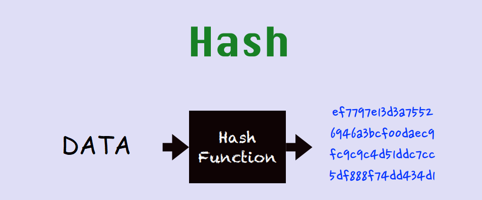
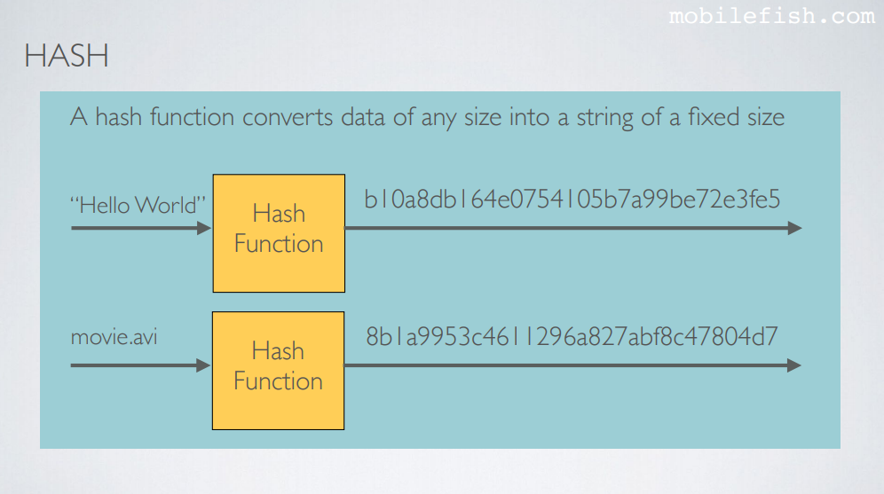
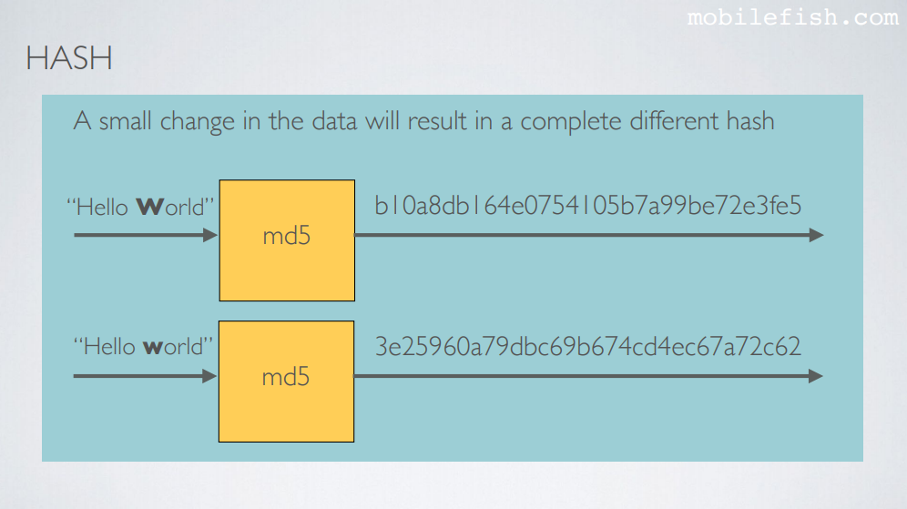
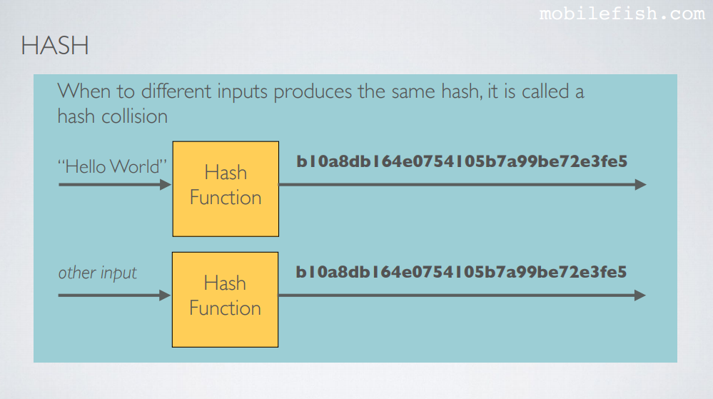
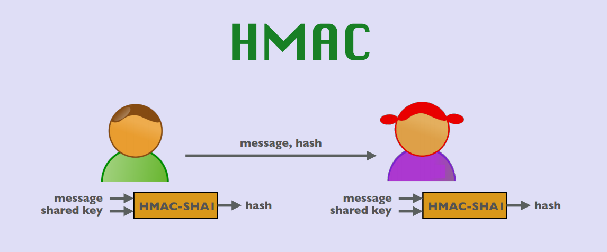
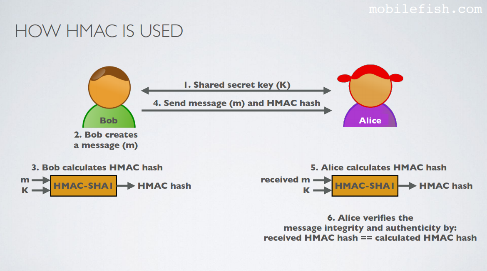
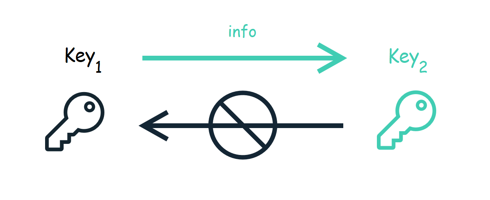
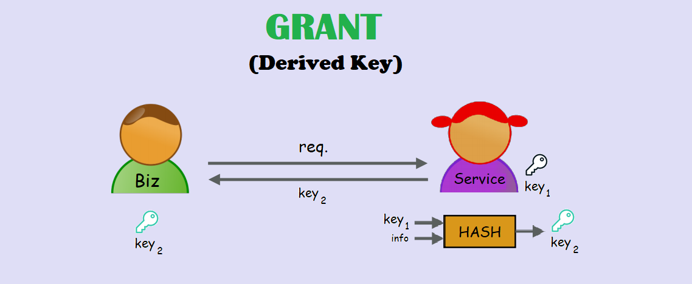
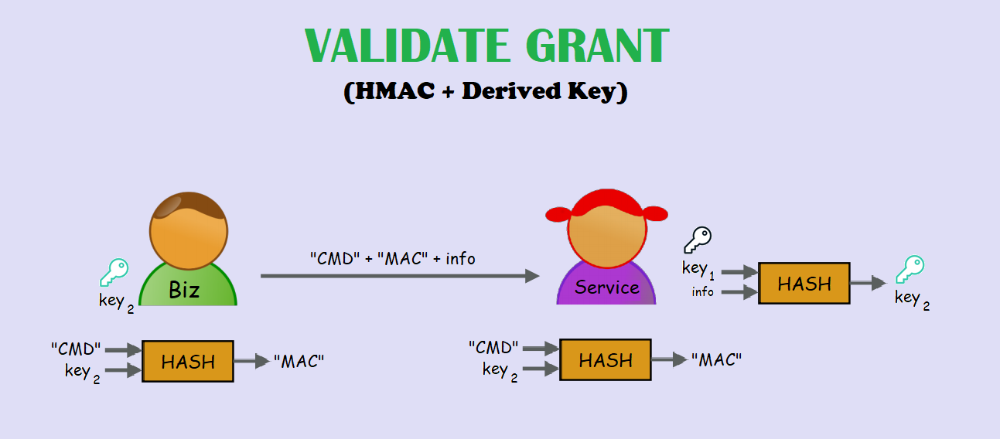

# Validate **Grant**

---

## Background

+++


---

## Hash

+++



+++



+++



+++



---

## HMAC
#### (**H**ash-based **M**essage **A**uthentication **C**ode)

+++



+++



---

## Derived **Key**

+++



---

## Grant
### Derived Key

+++



---

## Validate Grant
### HMAC + Derived Key

+++



--- 

## Rules of Derived key

+++

```cs
Given:
    Owner: "[O1]/[O2]/.../[On]"
    Grant: "[G1]/[G2]/.../[Gm]"

for(i=1;;i++) {
    if (Gi == Oi)
        owner = "[O1]/[O2]/.../[Oi]"
        grant = "[G1]/[G2]/.../[Gi]"
    else if (Grant.length (m) < i)
        owner = "[O1]/[O2]/.../[Oi-1]/[Oi]"
        grant = "[G1]/[G2]/.../[Gm]"
    else if (Owner.length (n) < i)
        owner = "[O1]/[O2]/.../[On]"
        grant = "[G1]/[G2]/.../[Gi-1]/[Gi]"
    else if (Gi != Oi)
        for (j=i; j > Grant.length (m); j++) {
            owner = grant = "[G1]/[G2]/.../[Gj]"
        }
        for (k=i; k > Owner.length (n); k++) {
            owner = "[O1]/[O2]/.../[Ok]"
            grant = "[G1]/[G2]/.../[Gm]"
        }
        break;
    else break;
}
```