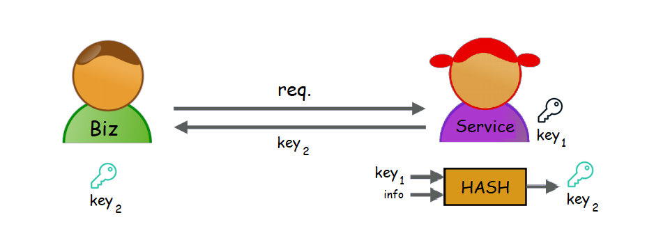

# Validate **Grant**

---

## Background

+++

### DB to Key

---

## Hash

+++

+++

+++

+++

---

## HMAC

+++

+++

---

## Derived Key

+++

---

## Validate Grant
### (HMAC + Derived Key)

+++?color=#EE5D58

## Subscription
### (Derived Key)

---

## Validate Grant

- Who   : Service
- What  : Validate Grant by HMAC + Derived Key
- Where : System
- When  : Biz(user) send CMD
- Why   : ตรวจสอบว่า CMD นี้ส่งมาจาก user ที่มีสิทธิ์เข้าถึง service นั้นๆ และข้อมูลไม่ได้ถูกเปลี่ยนระหว่างทาง
- how   : ...